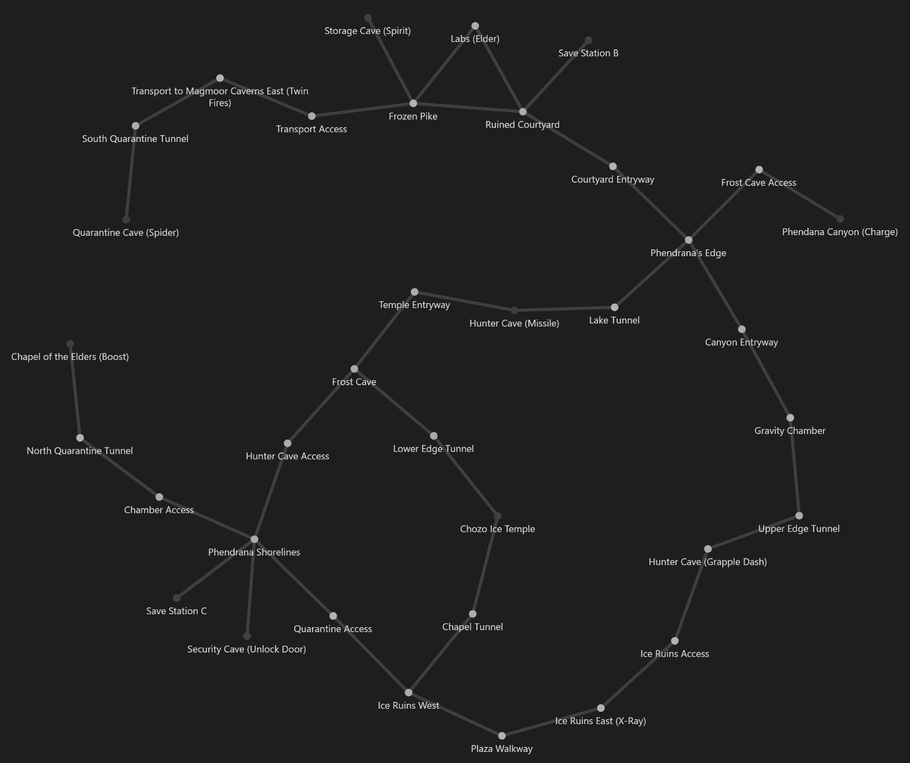

# Spoiler

## Elevators

- Tallon Canyon -> Main Plaza
- Root Cave -> Workstation [Mid Game]
- Sun Tower -> PPC [Late Game]
- Frigate Crash Site -> Lava Lake
- Monitor Station -> Phendrana Shorelines
- Quarantine Cave -> Twin Fires
- Workstation -> Main Quarry
- GTH -> Reflecting Pool (x2)

## Walkthrough

### Start

- SJF Jumpscare to unlock Artifact Temple
- Beetle Battles
- **Ruined Shrine - Morph Ball**

### Explore Early Game

- **Tower Chamber - Lifegiver**
- Artifact Temple lore established. Hints are blocked by Glorgie's shield
- Water Pool morph track
- **Water Pool - Missile Launcher**

### Sunchamber Requirements

#### Bombs

- Arboretum Scan Puzzle
- Watery Hall Scan Puzzle
- **Dynamo - Morph Ball Bomb**

#### Grapple

- NSJ Frigate Crash Site Climb
- Lake Tunnel no-jump heat run
- **Lake Tunnel - Grapple Beam**
- Hive Mecha+

### Sunchamber

- Transport Access North / Sun Tower Puzzles
- Flaahgra+
- **Sunchamber - Varia Suit**
- **Sunchamber - Wild**

### Journey to Phendrana

- Triclops Pit Yoku block sequence
- **Triclops Pit - Nature**

### Phendrana Mashup

- Early/Late phen room-rando labyrinth

- **Phendrana Canyon - Charge Beam**
- **Chozo Ice Temple - Bomb Slot Activated**
    - This unlocks a shortcut
- **Security Cave - Unlock Shoreline Door**
- Chapel Fight+
- **Chapel of the Elders - Boost Ball**

### Labs Requirements

#### Wave Beam

- Activate Geothermal Core bomb slot
- **Geothermal Core - Wave Beam**

#### Super Missile

- Piston Tunnel -> Training Chamber
- **Training Chamber Access - Super Missile**

### Labs

- Reverse Ruined Courtyard puzzle
- Power Specimen Storage Door
- Dark Labs+
- **Control Tower - Elder**
- **Research Core - Restore Gravity**

### Far Phendrana

- **Storage Cave - Spirit**
- *PoNR into Quarantine Cave Elevator (need spider to leave either direction)*

### Quarantine Cave

- **Quarantine Cave - Spider**
- Thardus+ to escape

### Ice Beam

- 1-way Ice Door to return to Late Magmoor
- **Ruined Shrine (Spider Track) - Ice Beam**
    - *Opens shortcut to bypass labs*

### Early Mines

- **Elite Research - Warrior**
- Dynamo Maze+
- **Central Dynamo - Power Bomb**
    - Unlock shortcut: Warrior Shrine -> Fiery Shores

### Plasma Beam

- Geothermal Core Spider Track
- **Plasma Processing - Plasma Beam**
    - Unlock shortcut: Fiery Shores -> Warrior Shrine
- Geothermal Core Morph Track
- **Gully - Gravity Suit**
- **Ice Ruins East - X-Ray Visor** (Disguised as Space Jump Boots)
- **Chozo Ice Temple - Sun**

### Late Mines

- **Missile Station Mines - Thermal Visor**
- Omega Pirate+
- **Elite Quarters - Space Jump Boots**
- **Phazon Mining Tunnel - Newborn**

### Cleanup

- **Tower of Light - Wavebuster**
- **Burn Dome - Flamethrower**
    - Unlocks PB Expansion in Storage Cavern
- Crossway Puzzle/Dash (Requires SJ)
- **Elder Chamber - Spirit**
- Great Tree Hall Climb (Requires Gravity Suit)
- **Life Grove - Ice Spreader**
- **Life Grove - Unclog Drain**
- **Life Grove - Chozo**

### Phazon Frigate

- Hydro Access Tunnel (requires Wavebuster, Flamethrower and "Unclogged Drain")
- Phazon Hell Run
- **Reactor Core - Glorgsmire Gumpybottom's Keyring**

### Artifact Return Policy

- **Artifact Temple - Phazon Suit**
- The long-con farce is finally revealed. The player must return any and all artifacts which they have collected to enter the crater, and the ghosts are angry about it. The player must deal with some or all of the following depending on which artifacts they "stole":
    - **Chozo**: Life Grove ghost fight
    - **Lifegiver**: Ruined Shrine ghost fight
    - **World**: HoTE ghost fight
    - **Wild**: Sunchamber ghost fight
    - **Nature**: Invincible flying pirates in Triclops Pit puzzle
    - **Strength**: Warrior Shrine but it's up high
    - **Elder**: Control Tower but they don't get to enjoy low gravity
    - **Sun**: The sheegoth and bombus are crowded in the artifact cubby
    - **Spirit**: It's an annoying room to reach
    - **Warrior**: Phazon Elite active
    - **Newborn**: Blocks require power bombs
- I like to give players a lollipop after punching them in the face so you can have your Ship back and I upgraded it so it can fly to/from any elevator in any region

### Bosses

- Player can enter Impact Crater freely once they posses no artifacts
- Exo
- Essence+
- Crater Escape Sequence
- Ridley+
- Credits

## Missile Expansions

- The highest possible Missile capacity is 172. In general, the harder a Missile is to acquire, the more capacity it provides.
- No one will actually finish with this missile count because of Root Cave

## Energy Tanks

| Room | Intended Collection |
| --- | --- |
| Frigate Crash Site | 1st Pass |
| Hive Mecha | 1st Pass |
| Magmoor Workstation | 2nd Pass needs boost |
| Frozen Pike | 1st Pass DBJ or 2nd Pass SJ |
| Gravity Chamber | 2nd Pass after Plasma and/or SJ |
| Main Quarry | 1st Pass crane meme |
| Metroid Quarantine A | 1st Pass hidden wall |
| Map Station Mines (Parasite Queen) | 2nd Pass SJ or 1st Pass UBJ |
| Monitor Station | 2nd Pass SJ |
| Frigate Crash Site | 3rd Pass GSJ |
| Arbor Chamber | 2nd Pass SJ |
| Great Tree Hall | 1st Pass spider track trick |
| Ice Ruins West | 2nd Pass SW |
| Watery Hall SW | 2nd Pass SJ |

## Power Bomb Expansions

| Region | Room |
| --- | --- |
| Magmoor Caverns | Storage Cavern |
| Phendrana Drifts | Map Station |
| Phazon Mines | Storage Depot A |
| Phazon Mines | Processing Center Access |
